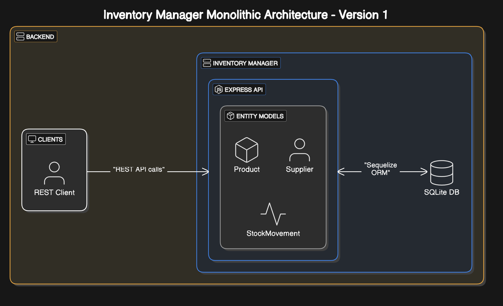

# Inventory Management System (Bazaar Case Study)

This Inventory Management System was developed as part of a Bazaar Technologies engineering case study. It demonstrates the evolution of a solution from a **simple prototype (V1)** to an **enterprise-ready** platform (V3) for managing retail inventory — keeping in mind the practices and approaches employed at **Bazaar**. Throughout this journey, we focused on scalable and resilient architecture, iteratively improved the design based on real-world scenarios, and aligned the system with Bazaar’s high-volume retail-tech ecosystem and engineering principles.

The following sections detail the **Code structure**, **Design Decisions**, **Assumptions**, **API Design**, and the **Evolution Rationale** across versions V1, V2, and V3.

> **Note:** As this is a detailed Readme, you can refer to the last section for a summary of the case study.
## Code Structure

The project repository is organized as follows:

```
📦 bazaar_case_study
├─ .gitignore
├─ Readme.md
├─ database.sqlite
├─ package-lock.json
├─ package.json
├─ public
│  └─ temp
│     └─ .gitkeep
└─ src
   ├─ app.js
   ├─ constants.js
   ├─ controllers
   │  ├─ v1
   │  │  ├─ product.controller.js
   │  │  ├─ stockmovement.controller.js
   │  │  └─ supplier.controller.js
   │  ├─ v2
   │  │  ├─ product.controller.js
   │  │  ├─ reporting.controller.js
   │  │  ├─ stockmovement.controller.js
   │  │  ├─ store.controller.js
   │  │  ├─ store_product.controller.js
   │  │  ├─ store_supplier_product.controller.js
   │  │  ├─ supplier.controller.js
   │  │  └─ user.controller.js
   │  └─ v3
   │     ├─ product.controller.js
   │     ├─ reporting.controller.js
   │     ├─ stockmovement.controller.js
   │     ├─ store.controller.js
   │     ├─ store_product.controller.js
   │     ├─ store_supplier_product.controller.js
   │     ├─ supplier.controller.js
   │     └─ user.controller.js
   ├─ db
   │  ├─ v1
   │  │  └─ index.js
   │  ├─ v2
   │  │  ├─ connection.js
   │  │  └─ index.js
   │  └─ v3
   │     ├─ connection.js
   │     ├─ index.js
   │     └─ redis.js
   ├─ events
   │  ├─ event_bus.js
   │  └─ listeners
   │     ├─ activity_log.listener.js
   │     ├─ invalidate_cache.listener.js
   │     └─ update_quantity.listener.js
   ├─ index.js
   ├─ middlewares
   │  ├─ auth.middleware.js
   │  ├─ authorize_roles.middleware.js
   │  ├─ distributed_api_rate_limiting.middleware.js
   │  └─ request_throttle.middleware.js
   ├─ models
   │  ├─ v1
   │  │  ├─ product.models.js
   │  │  ├─ stockmovement.models.js
   │  │  └─ supplier.models.js
   │  ├─ v2
   │  │  ├─ product.models.js
   │  │  ├─ stockmovement.models.js
   │  │  ├─ store.models.js
   │  │  ├─ store_product.models.js
   │  │  ├─ store_supplier_product.models.js
   │  │  ├─ supplier.models.js
   │  │  └─ user.models.js
   │  └─ v3
   │     ├─ activity_log.models.js
   │     ├─ product.models.js
   │     ├─ stockmovement.models.js
   │     ├─ store.models.js
   │     ├─ store_product.models.js
   │     ├─ store_supplier_product.models.js
   │     ├─ supplier.models.js
   │     └─ user.models.js
   ├─ routes
   │  ├─ v1
   │  │  ├─ product.routes.js
   │  │  ├─ stockmovement.routes.js
   │  │  └─ supplier.routes.js
   │  ├─ v2
   │  │  ├─ product.routes.js
   │  │  ├─ reporting.routes.js
   │  │  ├─ stockmovement.routes.js
   │  │  ├─ store.routes.js
   │  │  ├─ store_product.routes.js
   │  │  ├─ store_supplier_product.routes.js
   │  │  ├─ supplier.routes.js
   │  │  └─ user.routes.js
   │  └─ v3
   │     ├─ product.routes.js
   │     ├─ reporting.routes.js
   │     ├─ stockmovement.routes.js
   │     ├─ store.routes.js
   │     ├─ store_product.routes.js
   │     ├─ store_supplier_product.routes.js
   │     ├─ supplier.routes.js
   │     └─ user.routes.js
   └─ utils
      ├─ activity_logger.js
      ├─ api_error.js
      ├─ api_response.js
      ├─ async_handler.js
      └─ cache.js
```

## Code Overview

The codebase is implemented in **Node.js** using the **Express** framework, with **Sequelize ORM** for database interactions. It was incrementally refactored to accommodate new requirements and to adhere to best practices as the system matured:

- **V1**: A single-process Express application with a **simple, monolithic structure**. All logic (routes, business rules, and data access) resides in one service. Models for core entities (e.g., Product, Supplier, StockMovement) are defined via **Sequelize**. A lightweight **SQLite** database is used in development, leveraging Sequelize’s ease of setup for quick prototyping. This straightforward approach minimized initial complexity and enabled rapid development when the goal is to get early feedback from **Bazaar’s pilot customers**.

- **V2**: Refactored into a **modular layered architecture** for better maintainability and scalability. Code is organized into distinct layers/modules:
  - **Data Layer**: Defines Sequelize models for **Store, Product, Supplier, User**, and linking tables (e.g., `StoreProduct` for inventory per store and `StoreSupplierProduct` for tracking relations between all three). Switched to **PostgreSQL** as the primary database. Using Postgres improved reliability and supported the higher transactional volume expected in **Bazaar’s retail environment**.
  
  - **Service Layer**: Implements business logic and Express route handlers. Introduced middleware for **JWT authentication** and **role-based access control**, securing endpoints according to user roles (e.g., only managers can add or reorder stock). Incorporated **express-rate-limit** middleware to throttle requests, guarding the system’s **high-volume reliability** under stress.
  
  - These changes made the code more extensible and aligned with **Bazaar’s practice** of building robust systems as user needs grew. *For example*, adding a   - These changes made the code more extensible and aligned with **Bazaar’s practice** of building robust systems as user needs grew. *For example*, adding a new feature (like tracking inventory by store) now meant adding a model and related service logic without touching unrelated parts of the code.

- **V3**: Evolved into an **enterprise-ready codebase** structured for distributed deployment. The application can run in cluster mode (via **PM2**) to utilize multiple CPU cores, reflecting Bazaar’s emphasis on **horizontal scalability**. New modules and improvements include:

  - **Caching Module**: Implements caching using **Redis** for frequent read operations (e.g., inventory summary reports) using an in-memory store (with the option to use Redis in production). Cache invalidation logic is in place (triggered when stock updates occur) to ensure data consistency.

  - **Event Module**: Introduces an asynchronous **event bus** system to publish and subscribe to domain events (e.g., a stock level change event). This decouples expensive or cross-cutting tasks like audit logging from the main request flow.  
    The codebase has dedicated event handlers for tasks like **stock synchronization** with external systems and **activity logging** for audit trails, improving resilience and integrating smoothly with **Bazaar’s larger ecosystem of services**.

  - **Configuration & Deployment**: The project is production-ready with environment-based configurations (e.g., separate config for primary DB and read replicas, cache servers, etc.). It can be containerized and deployed behind a load balancer, and includes audits, ensuring it meets **Bazaar’s standards for observability and reliability in high-volume scenarios**.

## Design Decisions

Key design decisions were made to balance rapid development with long-term scalability and reliability. Each version’s design changes were deliberate, addressing the growing needs of Bazaar’s retail-tech environment and incorporating lessons learned from users:

- **Monolith First, Then Modular**: We began with a **monolithic architecture in V1** to deliver a working product quickly. This decision kept the initial design simple — a **single service** handled all responsibilities — which was ideal for early development and testing with a pilot store.  
  As the project validated its core functionality with users, we transitioned to a more **modular design in V2**, separating concerns (API, business logic, data access). This layered approach improved code maintainability and set the stage for scaling.  
  We intentionally avoided premature microservices to keep complexity manageable until it was truly needed, **reflecting Bazaar’s pragmatic approach of evolving systems in step with actual requirements**.

- **Database and Data Model**:  
  **V1** used an embedded **SQLite** database for simplicity, assuming low data volume.  
  In **V2**, we migrated to **PostgreSQL** to handle the growing scope of the app. The data model was expanded from basic products and suppliers to a **multi-store multi-supplier inventory schema**: introducing a `Store` entity and association tables *(e.g., linking stores to products, tracking which store sources which product, at what cost, and sells it at what price, etc.)*.  
  This normalization supports **Bazaar’s need to manage inventory across many stores and suppliers**.  
  By **V3**, we further enhanced the data layer by setting up a **primary-replica configuration for Postgres** to distribute read and write load and provide redundancy (the primary handles writes, while replicas serve heavy read traffic).  
  This design supports **high-volume read scenarios** common in retail.

- **Security and Access Control**:  
  Initially, **V1 had no authentication** (for speed of development, we assumed a trusted environment or single-user usage).  
  Recognizing the need for multi-user access as we onboarded more stores, **V2 introduced JWT-based authentication** for stateless security.  
  We integrated **role-based access control (RBAC)** to distinguish user permissions — *for example*, store staff can view and update stock, but only admins or managers can add new products or suppliers.  
  **Passwords** (if any user accounts were created) are stored securely with **hashing** (using `bcrypt`).  
  These security decisions were guided by real-world usage patterns and **Bazaar’s principle of safeguarding data**.

- **Performance Optimization**:  
  To ensure the system remained responsive with higher loads, we made performance-minded design choices.  
  In **V2**, we added **request rate limiting** at the API gateway layer to prevent any single client or store from overwhelming the service, thereby maintaining fairness and reliability during peak times.  
  By **V3**, given the high volume of inventory checks and updates in **Bazaar’s operations**, we implemented a **caching layer** for expensive queries (like generating a full stock report across all stores).  
  Cached data (with appropriate **TTL**) drastically improves read performance for repeated requests, and we use an **event-driven cache invalidation** strategy so that updates propagate immediately to cached data.  
  This design ensures that even as the number of stores and products grows, the system can serve frequent requests.

- **Resilience and Scalability**:  
  High availability was a critical consideration moving into **V3**.  
  We employed a **clustered deployment**, meaning multiple instances of the service run in parallel. This not only improves throughput (more requests served in parallel) but also provides **resilience** — if one instance crashes or a server goes down, others continue serving traffic, **aligning with Bazaar’s demand for resilient systems in production**.  
  We also embraced an **event-driven architecture** for certain operations, as shown by the introduction of an internal **Event Bus**.  
  *For example*, when stock is updated, an event is emitted so that other components (or even external services in **Bazaar’s ecosystem**) can react to it (e.g., update the current quantity) independently of the main transaction.  
  This **decoupling via events** makes the system more extensible and fault-tolerant — one component’s slowdown doesn’t directly impact others.  
  The decision to keep the core inventory service stateless (with all state living in the database and caches) further ensures ease of redeploying (adding more instances) and makes the system cloud-friendly.

 In summary, each design decision — from the early simplicity of a monolith to the sophisticated distributed architecture — **was driven by real needs**: improving scalability, maintaining reliability under high load, and incorporating feedback from actual usage.  
The result is a design that is both **customer-centric** (evolving features to match how store owners manage inventory) and **engineered for scale** (ready to handle **Bazaar’s nationwide B2B retail operations**).

---

## Assumptions

During development, we made several assumptions about the context and usage of the inventory system. These assumptions informed our design and were revisited as the system evolved:

- **Scope of Usage**: We assumed the system is primarily used by **retail store owners/managers and their staff** within Bazaar’s network.  
  **V1 targeted a single store scenario** (one inventory), under the assumption that we were first solving the problem for **one pilot store**.  
  As Bazaar planned to roll it out to multiple stores, **V2 expanded to multi-store support**, assuming each store’s inventory is managed separately but under a common platform.  
  **By V3, we assumed large-scale adoption** — potentially thousands of store integrations — which justified the need for a distributed, high-performance design.

- **Data Volume & Scale**: Early development assumed a modest number of products and transactions (suitable for an in-memory/file-based DB in V1).  
  We built V1 to handle maybe hundreds of products and daily stock updates for a single outlet. This assumption held for the prototype, but **by V2 we anticipated larger product catalogs and continuous stock movements across many stores**.  
  We assumed the database would need to handle **high write throughput** (sales, restocks, etc.) and even higher **read throughput** (point-of-sale systems checking stock).  
  This drove the **move to PostgreSQL in V2**.  
  In **V3**, we assumed read-heavy operations (like inventory lookups or report generation) could be offloaded to **replicas or caches**, and a **slight delay in updates would be acceptable** for non-critical reads.

- **User Roles and Authorization**:  
  We assumed different user roles with distinct permissions would use the system.  
  In **V1**, for simplicity, we effectively assumed a **single trusted user** (no auth checks).  
  By **V2**, based on **Bazaar’s operational needs**, we expected three roles (admin, store manager, and staff).  
  The permissions were set keeping in mind a typical retail/inventory scenario.  
  **JWT auth** was implemented, and directly supported **Bazaar’s use-cases** by allowing token **payloads to carry role info** and the **middleware to enforce those rules**.

- **Technology Environment**:  
  It was assumed that the system would be deployed in a **modern cloud environment (which Bazaar utilizes for its services)**.  
  This means we expected **reliable network connectivity** between the app and database servers.  
  We also assumed that **horizontally scaling** the service (running multiple instances) would be the primary strategy to handle increased load.  
  Thus we held with **statelessness** and **externalized state** (in DB, cache).

---

These assumptions were continually validated and adjusted according to the case study. They ensured that our design remained realistic and **tailored to the needs of Bazaar’s partners**.

## API Design

The Inventory Management System follows a **RESTful architecture**, evolving across three versions while remaining backward-compatible and aligned with **Bazaar Technologies’ growing operational needs**.  
API design was informed by **scalability, role-based access**, and **ease of integration** with Bazaar’s internal systems and external tools (e.g. POS apps, dashboards).  
Consistent structure was maintained using `async_handler`, `api_error`, and response custom classes, as well as **JWT-secured routes** from V2 onward.

*(Here are only a few examples and improvements that were made)*

---

### Version 1 (Single Store, Minimal API Surface)

In V1, APIs were kept simple to support a single-store pilot. Most endpoints used GET and POST only, with no authentication. Core functionality included:

- **Product Routes**:
  - `POST /add_product` – Add a new product.
  - `POST /update_product` – Update product info.
  - `GET /get_products` – Retrieve all products.
  - `GET /remove_product` – Remove a product (non-standard for delete, used temporarily).

- **Supplier Routes**:
  - `POST /add_supplier` – Add a supplier for the single store.

- **Stock Movement Routes**:
  - `POST /add_stock_movement` – Record incoming/outgoing stock.
  - `GET /get_stock_history` – Get movement for a specific product.
  - `GET /get_all_stock_history` – Retrieve entire store’s movement logs.

> This version emphasized quick setup over structure and was sufficient for single-store pilots and internal demos.

### Version 2 (Multi-Store, Multi-Supplier, Auth-Aware)

By V2, the system supported 500+ stores and was upgraded to **PostgreSQL**. Major API improvements included:

- **Authentication Layer**:
  - `POST /login`, `/logout`, `/register` – JWT-based login with role-based middleware (`admin`, `store_manager`, `staff`).
  - Role restrictions enforced via `authorize_roles` middleware.

- **Core CRUD APIs**:
  - **Products**:
    - `POST /create_product`, `PUT /update_product/:id`, `DELETE /delete_product/:id`
    - `GET /get_all_products`, `/get_filtered_products`, `/get_product/:id`

  - **Suppliers**:
    - `POST /create_supplier`, `PUT /update_supplier/:id`, `DELETE /delete_supplier/:id`
    - `GET /get_all_suppliers`, `/get_supplier/:id`

  - **Stores**:
    - `POST /create_store`, `PUT /update_store/:id`, `DELETE /delete_store/:id`
    - `GET /get_all_stores`, `/get_store/:id`

  - **Store-Product Mapping**:
    - `POST /create_store_product` – Link product to store with stock count.
    - `GET /get_store_products_by_store`, `/by_product`, `/by_category`

  - **Store-Supplier-Product Mapping**:
    - `POST /create_store_supplier_product` – Track which supplier provides which product to which store (with sourcing price).

  - **Stock Movements**:
    - `POST /record_stock_movement` – Record sale, stock-in, or manual removal.
    - `GET /get_all_stock_movements`, `/get_stock_movement/:id`
    - `GET /get_movements_by_store`, `/get_movements_by_date_range`

- **Reporting APIs**:
  - `GET /get_stock_summary_by_store` – Inventory breakdown by store.
  - `GET /get_sales_report_by_store_and_date` – Sales by store/date.
  - `GET /get_supplier_sourcing_summary` – Aggregated supplier info.
  - `GET /get_full_inventory_summary` – Snapshot across system.

> This version brought RESTful consistency, modularity, and security — with authentication, authorization, and structured filtering by store, category, and product.

---

### Version 3 (Scalable, Intelligent, High-Concurrency APIs)

Version 3 kept all V2 endpoints intact but added production-grade enhancements:

- **Caching Layer**:
  - Read-heavy routes like `/get_all_products`, `/get_full_inventory_summary`, and `/get_store_products_by_category` used **Redis** to reduce DB pressure.

- **Activity Logging**:
  - Hook-based and event-driven activity logs stored all CREATE/UPDATE/DELETE events.
  - All logs tracked the `user_id` and model context for auditing.

- **Real-Time Stock Sync**:
  - After creating stock movement, `stock_quantity` was automatically updated via **Sequelize** hooks and event listeners.

- **Read/Write Separation**:
  - **Sequelize** configured with replica DBs for reads (reporting APIs), with writes hitting the primary — ideal for 1000+ store scale.

- **Rate Limiting**:
  - `express-rate-limit` with Redis-backed distributed store limited abusive traffic. `/login` had custom throttling to prevent brute force.

- **User Management APIs**:
  - Admin-level APIs for managing users:
    - `PUT /update_user_role/:id`
    - `DELETE /delete_user/:id`
    - `GET /get_all_users`, `/get_users_by_store`

> This version was built for concurrency, observability, and maintainability. Bazaar’s inventory operations could now scale with confidence — ensuring stock integrity and fast responses under heavy load.


## Evolution Rationale (V1 → V3) - Summary

The system’s evolution from Version 1 through Version 3 was guided by the growing demands of the business. Each version addressed the limitations of its predecessor while laying groundwork for future needs, demonstrating a commitment to incremental improvement — similar to **Bazaar’s engineering philosophy**. Below, we outline the progression through V1, V2, and V3, highlighting the rationale for each major change:

### Version 1 – Monolithic Foundation

The first version established the core functionality in the **simplest way possible**. It featured:

- A single **Express** server
- A few **core models** (Product, Supplier, StockMovement)
- A **SQLite database**

This was chosen for speed: it allowed us to develop and deploy rapidly, get the basic inventory features working, and start gathering feedback from real usage.

In practice, V1 proved that the concept worked. However, V1 also revealed some **limitations**:

- No **authentication**
- Not ready for a **multi-user scenario**
- Using a **file-based DB** would not hold up once data volume and concurrent usage increased
- As more features were added, a **single-file or single-layer approach** became hard to maintain

These insights set the stage for a more structured approach in V2, as we say:  
**“Make it for single user first, then for thousands”.**




 

